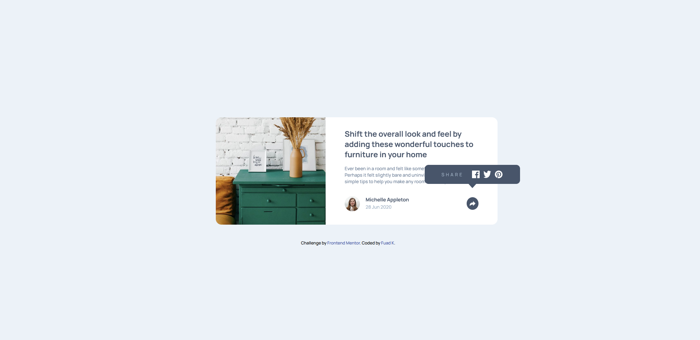
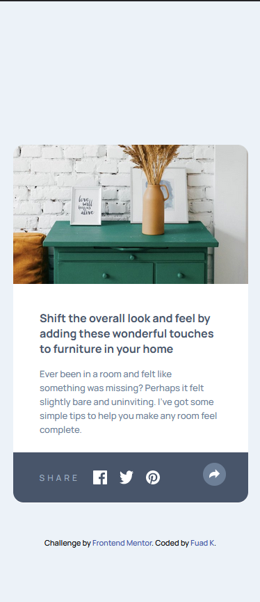

# Frontend Mentor - Article preview component solution

This is a solution to the [Article preview component challenge on Frontend Mentor](https://www.frontendmentor.io/challenges/article-preview-component-dYBN_pYFT). Frontend Mentor challenges help you improve your coding skills by building realistic projects. 

## Table of contents

- [Overview](#overview)
  - [The challenge](#the-challenge)
  - [Screenshot](#screenshot)
  - [Links](#links)
- [My process](#my-process)
  - [Built with](#built-with)
  - [What I learned](#what-i-learned)
  - [Continued development](#continued-development)
  - [Useful resources](#useful-resources)
- [Author](#author)

## Overview

### The challenge

Users should be able to:

- View the optimal layout for the component depending on their device's screen size
- See the social media share links when they click the share icon

### Screenshot

### Links

- Live Site URL: [Live Site](https://1toyosi.github.io/Preview-/)

## My process

### Built with

- Semantic HTML5 markup
- CSS custom properties
- Flexbox
- JavaScript

### What I learned

-I learnt how to make use of a modal-popUp in a design and more about using css to design shapes

### Continued development

- I would learn more on using overflows on images and learn how  to design different shapes using css.

### Useful resources

- [Triangles](https://www.youtube.com/watch?v=IMnYzR0zX0c) - I learnt how to design a triangle using the video in the link.
- [Modal PopUp](https://www.youtube.com/watch?v=gLWIYk0Sd38) - This is an amazing and straight-forward video on modal popUps

## Author

- Frontend Mentor - [@1toyosi](https://www.frontendmentor.io/profile/1toyosi)

